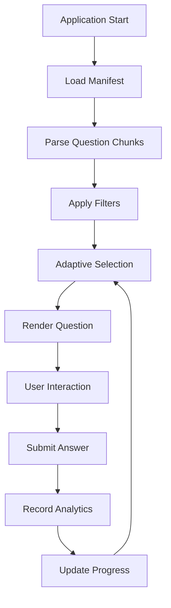

# SAT Practice Pro - Developer Guide

This comprehensive guide covers the technical architecture, development setup, and advanced customization options for the SAT Practice Pro application.

## 🏗 Architecture Overview

### System Design
SAT Practice Pro is built as a **Progressive Web Application (PWA)** using vanilla JavaScript with a modular architecture. The application operates entirely client-side with no backend dependencies, making it ideal for static hosting platforms like GitHub Pages.

```
┌─────────────────────────────────────────────────┐
│                    Frontend                     │
│  ┌─────────────┐ ┌─────────────┐ ┌─────────────┐│
│  │     UI      │ │  Analytics  │ │  Adaptive   ││
│  │ Components  │ │   Engine    │ │  Learning   ││
│  └─────────────┘ └─────────────┘ └─────────────┘│
│  ┌─────────────────────────────────────────────┐ │
│  │            Core Application                 │ │
│  │        (Question Management)                │ │
│  └─────────────────────────────────────────────┘ │
│  ┌─────────────┐ ┌─────────────┐ ┌─────────────┐│
│  │    Auth     │ │   Storage   │ │   Service   ││
│  │   Manager   │ │   Layer     │ │   Worker    ││
│  └─────────────┘ └─────────────┘ └─────────────┘│
└─────────────────────────────────────────────────┘
┌─────────────────────────────────────────────────┐
│                Data Layer                       │
│  ┌─────────────┐ ┌─────────────┐ ┌─────────────┐│
│  │  Question   │ │  Manifest   │ │   Lookup    ││
│  │   Chunks    │ │    Data     │ │    Tables   ││
│  └─────────────┘ └─────────────┘ └─────────────┘│
└─────────────────────────────────────────────────┘
```

### Core Components

#### 1. Application Core (`js/app.js`)
- **Responsibility**: Central controller managing application state
- **Key Functions**: Question loading, routing, UI coordination
- **Dependencies**: All other modules

#### 2. Authentication (`js/auth.js`)
- **Responsibility**: User management and session handling
- **Storage**: localStorage with encrypted user data
- **Features**: Login, signup, guest mode, session persistence

#### 3. Practice Session (`js/practice.js`)
- **Responsibility**: Practice flow management and question presentation
- **Features**: Multiple practice modes, question navigation, session state
- **Integration**: Connects with adaptive learning and analytics

#### 4. Adaptive Learning (`js/adaptive.js`)
- **Responsibility**: Intelligent question selection algorithm
- **Algorithm**: Spaced repetition with performance-based difficulty adjustment
- **Inputs**: User history, question metadata, performance trends

#### 5. Analytics Engine (`js/analytics.js`)
- **Responsibility**: Performance tracking and insights generation
- **Metrics**: Accuracy, speed, topic mastery, learning curves
- **Privacy**: All data stored locally, no external tracking

## 🔧 Development Environment

### Prerequisites
```bash
# Required
node -v    # v14+ (for development tools)
python -v  # v3.6+ (for data processing)
git --version

# Optional but recommended
npm -v     # For package management
```

### Quick Setup
```bash
# Clone repository
git clone https://github.com/gravishankar/sat-practice-pro.git
cd sat-practice-pro

# Install development dependencies (optional)
npm install -g live-server prettier eslint

# Start development server
live-server --port=8000 --entry-file=index.html

# Or use Python's built-in server
python -m http.server 8000
```

### Development Tools

#### Live Server with Auto-reload
```bash
# Install globally
npm install -g live-server

# Start with specific configuration
live-server --port=8000 --entry-file=index.html --wait=200
```

#### Code Formatting
```bash
# Install Prettier
npm install -g prettier

# Format all JavaScript files
prettier --write "js/*.js"

# Format CSS
prettier --write "css/*.css"
```

#### Linting
```bash
# Install ESLint
npm install -g eslint

# Lint JavaScript files
eslint js/*.js

# Fix auto-fixable issues
eslint js/*.js --fix
```

## 📁 File Structure Deep Dive

```
sat-practice-pro/
├── 🌐 Frontend Assets
│   ├── index.html           # Single-page application entry
│   ├── manifest.json        # PWA configuration
│   ├── sw.js               # Service worker (offline support)
│   └── favicon.ico         # Application icon
│
├── 🎨 Styling
│   └── css/
│       └── styles.css      # Mobile-first responsive design
│
├── ⚡ JavaScript Modules
│   └── js/
│       ├── app.js          # [Core] Main application controller
│       ├── auth.js         # [Core] Authentication & user management
│       ├── practice.js     # [Feature] Practice session management
│       ├── analytics.js    # [Feature] Performance tracking
│       ├── adaptive.js     # [Feature] Intelligent question selection
│       ├── progress.js     # [Feature] Progress visualization
│       ├── settings.js     # [Feature] User preferences
│       ├── hints.js        # [Feature] Progressive hint system
│       ├── explanations.js # [Feature] Answer explanations
│       ├── timer.js        # [Feature] Session timing
│       └── utils.js        # [Utility] Helper functions
│
├── 🗄 Data Layer
│   └── data/
│       ├── manifest.json   # Question bank metadata
│       ├── lookup.json     # Filter options and categories
│       └── chunks/         # Question data (chunked for performance)
│           ├── part-000.json  # Questions 1-1000
│           ├── part-001.json  # Questions 1001-2000
│           └── part-002.json  # Questions 2001-2017
│
├── 🔧 Development Tools
│   ├── prepare_data.py     # Data processing and normalization
│   ├── debug_geometry.py   # Debugging utilities
│   └── debug_raw_geometry.py
│
└── 📚 Documentation
    └── docs/
        ├── DEVELOPER_GUIDE.md  # This file
        └── USER_GUIDE.md       # End-user documentation
```

## 🏛 Code Architecture Patterns

### Module Pattern
Each JavaScript file follows a consistent module pattern:

```javascript
// Module: js/example.js
class ExampleModule {
    constructor(dependencies = {}) {
        this.app = dependencies.app;
        this.analytics = dependencies.analytics;
        this.init();
    }

    init() {
        this.setupEventListeners();
        this.loadInitialState();
    }

    setupEventListeners() {
        // Event binding logic
    }

    // Public API methods
    publicMethod() {
        return this._privateMethod();
    }

    // Private methods (prefixed with _)
    _privateMethod() {
        // Internal logic
    }
}
```

### Dependency Injection
Components receive dependencies through constructor injection:

```javascript
// In app.js
this.analytics = new Analytics({ app: this });
this.practice = new PracticeSession({ app: this, analytics: this.analytics });
this.adaptive = new AdaptiveLearning({ analytics: this.analytics });
```

### Event-Driven Architecture
Components communicate through custom events:

```javascript
// Publisher
this.dispatchEvent(new CustomEvent('questionAnswered', {
    detail: { questionId, isCorrect, timeSpent }
}));

// Subscriber
document.addEventListener('questionAnswered', (event) => {
    this.recordAnswer(event.detail);
});
```

## 🔄 Data Flow

### Question Loading Pipeline


### Data Processing Pipeline

#### 1. Raw Data Ingestion (`prepare_data.py`)
```python
def normalize(raw_question):
    """
    Normalizes raw SAT question data into standardized format
    
    Handles:
    - Multiple choice questions (Reading & Writing)
    - Grid-in questions (Math numerical answers)
    - Complex nested JSON structures
    - HTML content with MathJax expressions
    """
    content = raw_question.get("content", {})
    
    # Extract question content
    stimulus = content.get("stimulus", "")  # Passage for R&W
    stem = content.get("stem", "")          # Question text
    prompt = content.get("prompt", "")      # Math problems
    
    # Determine question type and extract choices
    if content.get("answerOptions"):
        # Multiple choice question
        choices = extract_mc_choices(content)
        question_type = "mcq"
    elif content.get("keys"):
        # Grid-in (numerical) question
        choices = None
        question_type = "numerical"
    
    return standardized_question_object
```

#### 2. Data Chunking Strategy
Questions are split into manageable chunks for optimal loading:

- **Chunk Size**: 1,000 questions per file
- **Benefits**: Lazy loading, reduced initial payload, better caching
- **Format**: Each chunk is a JSON array of standardized question objects

#### 3. Manifest Generation
```json
{
  "version": 1,
  "count": 2017,
  "chunks": [
    { "path": "chunks/part-000.json", "count": 1000 },
    { "path": "chunks/part-001.json", "count": 1000 },
    { "path": "chunks/part-002.json", "count": 17 }
  ]
}
```

## 🎯 Advanced Features Implementation

### Adaptive Learning Algorithm

The adaptive learning system uses a sophisticated algorithm that considers multiple factors:

```javascript
class AdaptiveLearning {
    selectNextQuestion(userHistory, availableQuestions) {
        // 1. Calculate user proficiency by topic
        const proficiency = this.calculateProficiency(userHistory);
        
        // 2. Apply spaced repetition for review
        const reviewCandidates = this.getSpacedRepetitionCandidates(userHistory);
        
        // 3. Weight questions by learning objectives
        const weighted = this.weightQuestionsByObjectives(
            availableQuestions, 
            proficiency
        );
        
        // 4. Apply difficulty progression rules
        const difficulty = this.getDifficultyTarget(proficiency);
        
        // 5. Select optimal question
        return this.selectOptimalQuestion(weighted, difficulty, reviewCandidates);
    }
    
    calculateProficiency(history) {
        /*
        Proficiency calculation considers:
        - Recent accuracy (weighted by recency)
        - Response time patterns
        - Topic-specific performance
        - Difficulty progression
        */
        const recent = history.slice(-20); // Last 20 questions
        const byTopic = this.groupByTopic(recent);
        
        return Object.keys(byTopic).reduce((prof, topic) => {
            const questions = byTopic[topic];
            const accuracy = this.calculateAccuracy(questions);
            const speed = this.calculateSpeedScore(questions);
            const trend = this.calculateTrend(questions);
            
            prof[topic] = {
                accuracy,
                speed,
                trend,
                confidence: questions.length >= 5 ? 'high' : 'low',
                score: (accuracy * 0.6) + (speed * 0.2) + (trend * 0.2)
            };
            
            return prof;
        }, {});
    }
}
```

### Analytics Implementation

The analytics system tracks comprehensive learning metrics:

```javascript
class Analytics {
    recordAnswer(questionData, userResponse, metadata) {
        const record = {
            timestamp: Date.now(),
            questionId: questionData.uId,
            module: questionData.module,
            topic: questionData.primary_class_cd_desc,
            skill: questionData.skill_desc,
            difficulty: questionData.difficulty,
            userAnswer: userResponse.answer,
            correctAnswer: questionData.correct_choice_index,
            isCorrect: userResponse.isCorrect,
            timeSpent: metadata.timeSpent,
            hintsUsed: metadata.hintsUsed,
            sessionId: this.currentSessionId
        };
        
        // Store locally
        this.appendToHistory(record);
        
        // Update real-time metrics
        this.updateSessionStats(record);
        
        // Trigger events for UI updates
        this.dispatchAnalyticsEvent('answerRecorded', record);
    }
    
    generateInsights() {
        const history = this.getHistory();
        
        return {
            overallStats: this.calculateOverallStats(history),
            topicBreakdown: this.calculateTopicBreakdown(history),
            difficultyProgression: this.calculateDifficultyProgression(history),
            timeAnalysis: this.calculateTimeAnalysis(history),
            streaks: this.calculateStreaks(history),
            recommendations: this.generateRecommendations(history),
            projectedScore: this.projectSATScore(history)
        };
    }
}
```

### Service Worker Implementation

The service worker provides robust offline functionality:

```javascript
// sw.js - Service Worker
const CACHE_NAME = 'sat-practice-v1.2.0';
const STATIC_CACHE = [
    '/',
    '/index.html',
    '/css/styles.css',
    '/js/app.js',
    '/js/auth.js',
    '/js/practice.js',
    '/js/analytics.js',
    '/js/adaptive.js',
    '/js/utils.js',
    '/data/manifest.json',
    '/data/lookup.json'
];

self.addEventListener('install', event => {
    event.waitUntil(
        caches.open(CACHE_NAME)
            .then(cache => cache.addAll(STATIC_CACHE))
    );
});

self.addEventListener('fetch', event => {
    event.respondWith(
        caches.match(event.request)
            .then(response => {
                // Return cached version or fetch from network
                return response || fetch(event.request);
            })
            .catch(() => {
                // Offline fallback for dynamic content
                if (event.request.destination === 'document') {
                    return caches.match('/index.html');
                }
            })
    );
});
```

## 🔌 API Reference

### Core Application API

#### `SATApp` Class
```javascript
// Initialize application
const app = new SATApp();
await app.init();

// Load specific question
const question = await app.loadQuestion(questionId);

// Display question in UI
app.displayQuestion(question);

// Submit user answer
const result = app.submitAnswer(userAnswer);
```

#### `PracticeSession` Class
```javascript
// Start new practice session
const session = new PracticeSession(app, {
    mode: 'adaptive',        // 'random', 'adaptive', 'timed', 'topic'
    topicFilter: null,       // Filter by specific topic
    difficultyFilter: null,  // Filter by difficulty level
    timeLimit: null,         // Time limit in minutes
    questionCount: 20        // Number of questions
});

session.start();

// Session events
session.on('questionDisplayed', (question) => { /* ... */ });
session.on('answerSubmitted', (result) => { /* ... */ });
session.on('sessionComplete', (summary) => { /* ... */ });
```

#### `Analytics` Class
```javascript
// Get performance insights
const insights = analytics.getInsights();

// Generate recommendations
const recommendations = analytics.getRecommendations();

// Export data
const exportData = analytics.exportData('json');
```

### Data Structures

#### Question Object
```javascript
{
    "uId": "unique-question-identifier",
    "questionId": "readable-id",
    "module": "math" | "reading-writing",
    "primary_class_cd_desc": "Topic Area",
    "skill_cd": "SKILL_CODE",
    "skill_desc": "Detailed Skill Description",
    "difficulty": "E" | "M" | "H",
    "score_band_range_cd": 1-8,
    "stem_html": "HTML content with MathJax",
    "choices": ["A", "B", "C", "D"] | null,
    "correct_choice_index": 0-3 | null,
    "explanation_html": "Detailed explanation",
    "question_type": "mcq" | "numerical"
}
```

#### User Progress Object
```javascript
{
    "userId": "user-identifier",
    "totalQuestions": 145,
    "correctAnswers": 108,
    "accuracy": 0.745,
    "averageTimePerQuestion": 78.5,
    "topicMastery": {
        "Algebra": { "accuracy": 0.82, "count": 23 },
        "Geometry": { "accuracy": 0.71, "count": 18 }
    },
    "difficultyProgression": {
        "E": { "accuracy": 0.89, "count": 45 },
        "M": { "accuracy": 0.73, "count": 67 },
        "H": { "accuracy": 0.58, "count": 33 }
    },
    "streaks": {
        "current": 5,
        "longest": 12,
        "dailyPractice": 7
    },
    "projectedScore": 1340
}
```

## 🧪 Testing Strategy

### Unit Testing Setup
```bash
# Install testing framework
npm install --save-dev jest jsdom

# Create test configuration
cat > jest.config.js << EOF
module.exports = {
    testEnvironment: 'jsdom',
    setupFilesAfterEnv: ['<rootDir>/tests/setup.js'],
    collectCoverageFrom: [
        'js/*.js',
        '!js/sw.js'
    ]
};
EOF
```

### Sample Test Cases
```javascript
// tests/app.test.js
import { SATApp } from '../js/app.js';

describe('SATApp', () => {
    let app;
    
    beforeEach(() => {
        app = new SATApp();
    });
    
    test('should initialize with default settings', () => {
        expect(app.settings).toBeDefined();
        expect(app.questions).toEqual([]);
    });
    
    test('should load questions from manifest', async () => {
        const mockManifest = {
            version: 1,
            count: 2017,
            chunks: [{ path: 'chunks/part-000.json', count: 1000 }]
        };
        
        // Mock fetch
        global.fetch = jest.fn(() =>
            Promise.resolve({
                json: () => Promise.resolve(mockManifest)
            })
        );
        
        await app.loadManifest();
        expect(app.manifest).toEqual(mockManifest);
    });
});
```

### Integration Testing
```javascript
// tests/integration/practice-flow.test.js
describe('Practice Flow Integration', () => {
    test('should complete full practice session', async () => {
        const app = new SATApp();
        const practice = new PracticeSession(app);
        
        await app.init();
        
        // Start session
        const session = practice.startSession({
            mode: 'random',
            questionCount: 5
        });
        
        // Answer questions
        for (let i = 0; i < 5; i++) {
            const question = practice.getCurrentQuestion();
            const answer = question.choices ? 0 : '42';
            practice.submitAnswer(answer);
            practice.nextQuestion();
        }
        
        // Verify session completion
        expect(practice.isComplete()).toBe(true);
        const summary = practice.getSessionSummary();
        expect(summary.totalQuestions).toBe(5);
    });
});
```

### Manual Testing Checklist

#### Core Functionality
- [ ] Application loads without errors
- [ ] Questions display correctly with MathJax rendering
- [ ] Answer submission works for both MCQ and grid-in
- [ ] Navigation between questions functions properly
- [ ] Progress tracking updates accurately

#### Progressive Web App
- [ ] App installs as PWA on supported devices
- [ ] Offline functionality works after initial load
- [ ] Service worker caches resources correctly
- [ ] App works in airplane mode

#### Responsive Design
- [ ] Layout adapts to mobile devices (320px+)
- [ ] Touch interactions work on mobile
- [ ] Text remains readable on small screens
- [ ] Navigation is accessible on all devices

#### Analytics & Adaptive Learning
- [ ] Performance metrics calculate correctly
- [ ] Adaptive algorithm selects appropriate questions
- [ ] Progress charts render accurately
- [ ] Recommendations align with performance data

## 🚀 Deployment Guide

### GitHub Pages Deployment
```bash
# 1. Ensure code is pushed to main branch
git add .
git commit -m "Deploy to GitHub Pages"
git push origin main

# 2. Enable GitHub Pages in repository settings
# Navigate to Settings > Pages > Source: Deploy from branch > main

# 3. Custom domain (optional)
echo "satpractice.yourdomain.com" > CNAME
git add CNAME
git commit -m "Add custom domain"
git push
```

### Netlify Deployment
```bash
# 1. Build configuration (netlify.toml)
cat > netlify.toml << EOF
[build]
  publish = "."

[[headers]]
  for = "/*.json"
  [headers.values]
    Cache-Control = "public, max-age=3600"

[[headers]]
  for = "/sw.js"
  [headers.values]
    Cache-Control = "no-cache"
EOF

# 2. Deploy via GitHub integration or drag-and-drop
```

### Custom Server Deployment
```bash
# Nginx configuration
server {
    listen 80;
    server_name satpractice.example.com;
    root /var/www/sat-practice-pro;
    index index.html;
    
    # Enable gzip compression
    gzip on;
    gzip_types text/css application/javascript application/json;
    
    # Cache static assets
    location ~* \.(js|css|json)$ {
        expires 1h;
        add_header Cache-Control "public, immutable";
    }
    
    # PWA requirements
    location /manifest.json {
        add_header Content-Type application/manifest+json;
    }
    
    location /sw.js {
        add_header Cache-Control "no-cache";
    }
    
    # Fallback for SPA
    try_files $uri $uri/ /index.html;
}
```

## 🔧 Customization & Extension

### Adding New Question Types
1. **Extend Question Schema**:
```javascript
// In prepare_data.py
def normalize_new_question_type(raw_question):
    return {
        // ... existing fields
        "question_type": "new_type",
        "custom_data": extract_custom_data(raw_question)
    }
```

2. **Update UI Rendering**:
```javascript
// In app.js
renderQuestion(question) {
    switch(question.question_type) {
        case 'mcq':
            return this.renderMultipleChoice(question);
        case 'numerical':
            return this.renderGridIn(question);
        case 'new_type':
            return this.renderNewType(question);
    }
}
```

### Custom Analytics Metrics
```javascript
// Extend analytics.js
class CustomAnalytics extends Analytics {
    calculateCustomMetric(history) {
        // Your custom calculation logic
        return history.reduce((metric, answer) => {
            // Process each answer record
            return updatedMetric;
        }, initialValue);
    }
    
    generateCustomInsights() {
        const insights = super.generateInsights();
        insights.customMetric = this.calculateCustomMetric(this.getHistory());
        return insights;
    }
}
```

### Theme Customization
```css
/* Override CSS variables in styles.css */
:root {
    --primary-color: #your-brand-color;
    --secondary-color: #your-accent-color;
    --text-color: #your-text-color;
    --background-color: #your-bg-color;
}

/* Dark mode overrides */
[data-theme="dark"] {
    --primary-color: #dark-mode-primary;
    --background-color: #dark-mode-bg;
}
```

## 🐛 Debugging & Troubleshooting

### Debug Mode
Enable comprehensive logging:
```javascript
// Enable debug mode
localStorage.setItem('sat-debug', 'true');

// Debug specific modules
localStorage.setItem('sat-debug-analytics', 'true');
localStorage.setItem('sat-debug-adaptive', 'true');
```

### Common Issues & Solutions

#### Questions Not Loading
```javascript
// Check manifest loading
console.log('Manifest:', await fetch('/data/manifest.json').then(r => r.json()));

// Verify chunk loading
console.log('Chunk 0:', await fetch('/data/chunks/part-000.json').then(r => r.json()));
```

#### MathJax Not Rendering
```javascript
// Check MathJax status
console.log('MathJax loaded:', typeof MathJax !== 'undefined');
console.log('MathJax ready:', MathJax?.startup?.document?.state?.() >= 6);

// Force re-render
window.reprocessMathJax?.();
```

#### Performance Issues
```javascript
// Monitor memory usage
console.log('Memory:', performance.memory);

// Check for memory leaks
const observer = new PerformanceObserver((list) => {
    list.getEntries().forEach((entry) => {
        console.log('Performance:', entry);
    });
});
observer.observe({entryTypes: ['measure', 'navigation']});
```

### Development Tools Integration

#### VS Code Configuration
```json
// .vscode/settings.json
{
    "emmet.includeLanguages": {
        "javascript": "html"
    },
    "files.associations": {
        "*.js": "javascript"
    },
    "editor.tabSize": 2,
    "editor.insertSpaces": true
}
```

#### Chrome DevTools Tips
1. **Application Tab**: Check Service Worker status and cache contents
2. **Performance Tab**: Profile JavaScript execution and rendering
3. **Lighthouse**: Audit PWA compliance and performance
4. **Console**: Use debug commands and inspect application state

## 📚 Additional Resources

### Learning Resources
- [Progressive Web Apps Guide](https://web.dev/progressive-web-apps/)
- [Service Workers Explained](https://developers.google.com/web/fundamentals/primers/service-workers)
- [MathJax Documentation](https://docs.mathjax.org/)
- [Modern JavaScript Features](https://developer.mozilla.org/en-US/docs/Web/JavaScript)

### Community & Support
- GitHub Issues for bug reports and feature requests
- Stack Overflow for technical questions
- MDN Web Docs for web standards reference
- Can I Use for browser compatibility information

### Contributing Guidelines
1. **Code Style**: Follow existing patterns and naming conventions
2. **Documentation**: Update relevant documentation for new features
3. **Testing**: Include tests for new functionality
4. **Performance**: Consider impact on application performance
5. **Accessibility**: Ensure new features are accessible to all users

---

This developer guide provides comprehensive technical documentation for working with and extending the SAT Practice Pro application. For additional support or questions, please refer to the project's GitHub repository or contact the development team.