# Developer Design Document
## SAT Skill Practice Module

**Version:** 1.0
**Date:** September 19, 2025
**Status:** In Development

---

## 🏗️ Architecture Overview

The Skill Practice Module implements a parallel practice system alongside existing functionality, using a feature flag approach to ensure zero regression while providing enhanced skill-based practice capabilities.

```mermaid
graph TB
    A[Main Menu] --> B[Existing Practice]
    A --> C[Words in Context]
    A --> D[Skill Practice 🚩]

    D --> E[Information & Ideas]
    D --> F[Expression of Ideas]
    D --> G[Craft & Structure]
    D --> H[Standard English Conventions]

    E --> I[Individual Skills]
    E --> J[Topic Practice]

    I --> K[Strategy → Questions → Results]
    J --> K
```



## 📁 Directory Structure

### New Directories Created
```
data/
├── practice-skills/                    # New parallel directory
│   ├── manifest.json                  # Skill configuration & metadata
│   ├── strategies/                    # Strategy content extracted from lessons
│   │   ├── central-ideas-strategy.json
│   │   ├── command-of-evidence-strategy.json
│   │   └── ... (10 strategy files)
│   ├── questions/                     # Filtered question sets
│   │   ├── information-and-ideas/
│   │   │   ├── central-ideas.json     # CID questions
│   │   │   ├── command-of-evidence.json # COE questions
│   │   │   └── inferences.json        # INF questions
│   │   ├── expression-of-ideas/
│   │   │   ├── rhetorical-synthesis.json # SYN questions
│   │   │   └── transitions.json       # TRA questions
│   │   ├── craft-and-structure/
│   │   │   ├── words-in-context.json  # WIC questions
│   │   │   ├── text-structure-purpose.json # TSP questions
│   │   │   └── cross-text-connections.json # CTC questions
│   │   └── standard-english-conventions/
│   │       ├── boundaries.json        # BOU questions
│   │       └── form-structure-sense.json # FSS questions
│   └── config/
│       ├── skill-mappings.json        # Skill CD to description mapping
│       └── difficulty-weights.json    # Difficulty distribution settings
```

### Existing Structure (Unchanged)
```
data/
├── chunks/                            # Existing - untouched
│   ├── part-001.json                 # Source data for all questions
│   └── words-in-context.json         # Existing WIC implementation
js/
├── practice.js                       # Existing - untouched
├── words-in-context.js               # Existing - untouched
└── skill-practice.js                 # New module
```

## 🎯 Core Components

### 1. SkillPracticeManager
**Responsibility**: Main orchestrator for skill practice functionality

```javascript
class SkillPracticeManager {
    constructor(app) {
        this.app = app;
        this.isEnabled = this.checkFeatureFlag();
        this.skillConfig = null;
        this.currentSession = null;
        this.strategyEngine = new StrategyEngine();
        this.questionEngine = new QuestionEngine();
    }

    async initialize() {
        if (!this.isEnabled) return;

        await this.loadSkillConfiguration();
        this.setupMenuIntegration();
        this.setupEventListeners();
    }

    // Core methods
    async startSkillPractice(skillCodes, mode = 'individual') { }
    async loadStrategy(skillCode) { }
    async getQuestions(skillCodes, count = 10) { }
    async saveResults(sessionData) { }
}
```

### 2. StrategyEngine
**Responsibility**: Strategy content management and presentation

```javascript
class StrategyEngine {
    constructor() {
        this.strategies = new Map();
        this.lessonExtractor = new LessonStrategyExtractor();
    }

    async loadStrategy(skillCode) {
        // Load from cache or extract from lessons
        if (!this.strategies.has(skillCode)) {
            const strategy = await this.lessonExtractor.extractStrategy(skillCode);
            this.strategies.set(skillCode, strategy);
        }
        return this.strategies.get(skillCode);
    }

    async updateStrategy(skillCode, newContent) {
        // Future: Strategy update tool functionality
        this.strategies.set(skillCode, newContent);
        await this.saveToStorage(skillCode, newContent);
    }
}
```

### 3. QuestionEngine
**Responsibility**: Question filtering, randomization, and delivery

```javascript
class QuestionEngine {
    constructor() {
        this.questionCache = new Map();
        this.chunkData = null;
    }

    async loadChunkData() {
        if (!this.chunkData) {
            const response = await fetch('data/chunks/part-001.json');
            this.chunkData = await response.json();
        }
    }

    async getQuestionsBySkill(skillCode, count = 10, difficulty = 'mixed') {
        await this.loadChunkData();

        // Filter by module and skill_cd
        const filtered = this.chunkData.filter(q =>
            q.module === 'reading-writing' &&
            q.skill_cd === skillCode
        );

        // Apply difficulty filter if specified
        let questions = difficulty === 'mixed' ?
            filtered :
            filtered.filter(q => q.difficulty === difficulty);

        // Randomize and limit
        return this.shuffleArray(questions).slice(0, count);
    }

    async getQuestionsByTopic(topicSkills, count = 15) {
        // Get questions from multiple skills within a topic
        const allQuestions = [];

        for (const skillCode of topicSkills) {
            const skillQuestions = await this.getQuestionsBySkill(skillCode, Math.ceil(count / topicSkills.length));
            allQuestions.push(...skillQuestions);
        }

        return this.shuffleArray(allQuestions).slice(0, count);
    }
}
```

## 📊 Data Models

### Skill Configuration (manifest.json)
```json
{
  "version": "1.0",
  "lastUpdated": "2025-09-19",
  "topics": {
    "information_and_ideas": {
      "id": "information_and_ideas",
      "title": "Information and Ideas",
      "description": "Comprehension and analysis of informational content",
      "skills": {
        "CID": {
          "code": "CID",
          "title": "Central Ideas and Details",
          "description": "Identify main ideas and supporting details",
          "questionCount": 66,
          "strategyFile": "central-ideas-strategy.json",
          "color": "#3B82F6"
        },
        "COE": {
          "code": "COE",
          "title": "Command of Evidence",
          "description": "Use textual evidence to support analysis",
          "questionCount": 151,
          "strategyFile": "command-of-evidence-strategy.json",
          "color": "#3B82F6"
        },
        "INF": {
          "code": "INF",
          "title": "Inferences",
          "description": "Draw logical conclusions from text",
          "questionCount": 74,
          "strategyFile": "inferences-strategy.json",
          "color": "#3B82F6"
        }
      }
    }
  }
}
```

### Strategy Content Model
```json
{
  "skillCode": "CID",
  "title": "Central Ideas and Details Strategy",
  "version": "1.0",
  "extractedFrom": "information-and-ideas-fundamentals.json",
  "lastUpdated": "2025-09-19",
  "slides": [
    {
      "id": "strategy-overview",
      "type": "introduction",
      "title": "Finding Central Ideas",
      "content": {
        "summary": "Learn to identify main ideas vs. supporting details",
        "keyPoints": [
          "Look for repeated themes",
          "Identify topic sentences",
          "Distinguish main from minor details"
        ]
      }
    },
    {
      "id": "strategy-steps",
      "type": "process",
      "title": "4-Step Process",
      "content": {
        "steps": [
          "Read the passage carefully",
          "Identify the main topic",
          "Find supporting evidence",
          "Eliminate incorrect answers"
        ]
      }
    }
  ]
}
```

### Practice Session Model
```javascript
class PracticeSession {
    constructor(config) {
        this.id = generateSessionId();
        this.skillCodes = config.skillCodes;
        this.mode = config.mode; // 'individual' | 'topic'
        this.questions = [];
        this.currentQuestionIndex = 0;
        this.startTime = Date.now();
        this.answers = [];
        this.strategyViewed = false;
        this.results = null;
    }

    recordAnswer(questionId, selectedChoice, isCorrect, timeSpent) { }
    calculateResults() { }
    getPerformanceBySkill() { }
}
```

## 🔧 Feature Flag Implementation

### Feature Flag Strategy
```javascript
class FeatureFlags {
    static SKILL_PRACTICE_ENABLED = 'skillPracticeEnabled';

    static isEnabled(flagName) {
        // Check multiple sources in priority order:
        // 1. URL parameter (?skillPractice=true)
        // 2. localStorage setting
        // 3. Default configuration

        const urlParams = new URLSearchParams(window.location.search);
        if (urlParams.has('skillPractice')) {
            return urlParams.get('skillPractice') === 'true';
        }

        const stored = localStorage.getItem(flagName);
        if (stored !== null) {
            return stored === 'true';
        }

        return CONFIG.features[flagName] || false;
    }

    static setEnabled(flagName, value) {
        localStorage.setItem(flagName, value.toString());
        // Trigger UI update
        window.dispatchEvent(new CustomEvent('featureFlagChanged', {
            detail: { flag: flagName, enabled: value }
        }));
    }
}
```

### Settings Integration
```html
<!-- In Settings Modal -->
<div class="feature-toggle">
    <label for="skillPracticeToggle">
        <strong>Enhanced Practice Mode</strong>
        <small>Practice by specific skills with guided strategies</small>
    </label>
    <input type="checkbox" id="skillPracticeToggle" />
</div>
```

## 🎨 UI Components

### Menu Integration
```html
<!-- New menu item (conditionally rendered) -->
<div class="nav-item skill-practice-nav" style="display: none;">
    <a href="#skill-practice" data-page="skill-practice">
        <span class="nav-icon">🎯</span>
        <span class="nav-text">Skill Practice</span>
        <span class="nav-badge">New</span>
    </a>
</div>
```

### Skill Selection Interface
```html
<div class="skill-practice-page">
    <div class="skill-topics">
        <div class="topic-card" data-topic="information_and_ideas">
            <h3>📊 Information and Ideas</h3>
            <p>291 questions across 3 skills</p>
            <div class="skill-list">
                <div class="skill-item" data-skill="CID">
                    <span class="skill-title">Central Ideas and Details</span>
                    <span class="question-count">66 questions</span>
                </div>
                <!-- More skills... -->
            </div>
            <div class="practice-options">
                <button class="btn-practice-individual">Practice Individual Skills</button>
                <button class="btn-practice-topic">Practice All Skills</button>
            </div>
        </div>
    </div>
</div>
```

## 🔄 Data Processing Pipeline

### Question Extraction Process
```javascript
async function extractQuestionsToFiles() {
    // 1. Load source data
    const chunkData = await loadChunkData('data/chunks/part-001.json');

    // 2. Filter reading-writing questions
    const rwQuestions = chunkData.filter(q => q.module === 'reading-writing');

    // 3. Group by skill_cd
    const groupedBySkill = groupBy(rwQuestions, 'skill_cd');

    // 4. Map to topic structure
    const skillMapping = await loadSkillMapping();

    // 5. Generate files
    for (const [skillCode, questions] of Object.entries(groupedBySkill)) {
        const topicInfo = skillMapping[skillCode];
        const filepath = `data/practice-skills/questions/${topicInfo.topic}/${topicInfo.filename}`;

        await writeFile(filepath, {
            skillCode,
            skillTitle: topicInfo.title,
            questionCount: questions.length,
            lastUpdated: new Date().toISOString(),
            questions: questions
        });
    }
}
```

### Strategy Extraction Process
```javascript
async function extractStrategiesFromLessons() {
    const lessonManifest = await loadLessonManifest();
    const skillStrategies = {};

    // Map lesson content to skill strategies
    const lessonToSkillMapping = {
        'central-ideas': 'CID',
        'command-of-evidence': 'COE',
        'words-in-context': 'WIC',
        // ... more mappings
    };

    for (const [lessonKey, skillCode] of Object.entries(lessonToSkillMapping)) {
        const lesson = await loadLesson(lessonKey);
        const strategy = extractStrategySlides(lesson);

        skillStrategies[skillCode] = {
            skillCode,
            title: `${getSkillTitle(skillCode)} Strategy`,
            extractedFrom: lessonKey,
            version: "1.0",
            lastUpdated: new Date().toISOString(),
            slides: strategy
        };
    }

    return skillStrategies;
}
```

## 🧪 Testing Strategy

### Unit Tests
```javascript
// Question filtering tests
describe('QuestionEngine', () => {
    test('filters questions by skill code correctly', async () => {
        const engine = new QuestionEngine();
        const questions = await engine.getQuestionsBySkill('CID', 10);

        expect(questions).toHaveLength(10);
        expect(questions.every(q => q.skill_cd === 'CID')).toBe(true);
        expect(questions.every(q => q.module === 'reading-writing')).toBe(true);
    });

    test('respects difficulty filtering', async () => {
        const engine = new QuestionEngine();
        const easyQuestions = await engine.getQuestionsBySkill('CID', 5, 'E');

        expect(easyQuestions.every(q => q.difficulty === 'E')).toBe(true);
    });
});

// Strategy engine tests
describe('StrategyEngine', () => {
    test('loads and caches strategies correctly', async () => {
        const engine = new StrategyEngine();
        const strategy1 = await engine.loadStrategy('CID');
        const strategy2 = await engine.loadStrategy('CID');

        expect(strategy1).toBe(strategy2); // Same reference (cached)
        expect(strategy1.skillCode).toBe('CID');
    });
});
```

### Integration Tests
```javascript
// Full practice session flow
describe('Practice Session Integration', () => {
    test('complete skill practice session', async () => {
        const manager = new SkillPracticeManager(mockApp);
        await manager.initialize();

        // Start session
        const session = await manager.startSkillPractice(['CID'], 'individual');
        expect(session.questions).toHaveLength(10);

        // View strategy
        const strategy = await session.loadStrategy();
        expect(strategy.slides).toBeDefined();

        // Answer questions
        for (let i = 0; i < session.questions.length; i++) {
            session.recordAnswer(session.questions[i].questionId, 0, true, 30000);
        }

        // Get results
        const results = session.calculateResults();
        expect(results.score).toBeDefined();
        expect(results.skillPerformance).toBeDefined();
    });
});
```

## 🚀 Deployment Strategy

### Phase 1: Infrastructure Setup
```bash
# Create directory structure
mkdir -p data/practice-skills/{questions,strategies,config}
mkdir -p data/practice-skills/questions/{information-and-ideas,expression-of-ideas,craft-and-structure,standard-english-conventions}

# Generate initial data files
node scripts/extract-questions.js
node scripts/extract-strategies.js
node scripts/generate-manifest.js
```

### Phase 2: Feature Flag Rollout
1. **Developer Testing**: Feature flag enabled via URL parameter
2. **Internal Testing**: Feature flag in localStorage for team
3. **Beta Testing**: Feature flag in settings for select users
4. **General Availability**: Feature flag default enabled

### Phase 3: Monitoring & Optimization
- Performance monitoring for question loading
- User behavior analytics for practice patterns
- Strategy effectiveness measurement
- Question difficulty calibration

## 🔧 Maintenance & Updates

### Strategy Update Tool (Future)
```javascript
class StrategyUpdateTool {
    constructor() {
        this.lessonWatcher = new LessonFileWatcher();
        this.strategyGenerator = new StrategyGenerator();
    }

    async updateStrategyFromLesson(lessonId, skillCode) {
        const lesson = await this.loadLesson(lessonId);
        const newStrategy = await this.strategyGenerator.extractStrategy(lesson, skillCode);

        // Validate strategy content
        const validation = await this.validateStrategy(newStrategy);
        if (!validation.isValid) {
            throw new Error(`Strategy validation failed: ${validation.errors}`);
        }

        // Update strategy file
        await this.saveStrategy(skillCode, newStrategy);

        // Clear cache
        this.clearStrategyCache(skillCode);

        return newStrategy;
    }

    async watchLessonsForChanges() {
        this.lessonWatcher.on('lessonUpdated', async (lessonId) => {
            const affectedSkills = this.getSkillsForLesson(lessonId);
            for (const skillCode of affectedSkills) {
                await this.updateStrategyFromLesson(lessonId, skillCode);
            }
        });
    }
}
```

### Configuration Management
```json
// config/update-rules.json
{
  "strategyUpdateRules": {
    "autoUpdate": false,
    "requireApproval": true,
    "backupBeforeUpdate": true,
    "notifyOnChanges": true
  },
  "lessonToSkillMapping": {
    "information-and-ideas-fundamentals": ["CID", "COE", "INF"],
    "craft-and-structure-fundamentals": ["WIC", "TSP", "CTC"],
    "expression-of-ideas-fundamentals": ["SYN", "TRA"],
    "standard-english-conventions-fundamentals": ["BOU", "FSS"]
  }
}
```

## 📏 Performance Considerations

### Optimization Strategies
1. **Lazy Loading**: Load questions only when skill is selected
2. **Caching**: Cache strategies and question sets in memory
3. **Pagination**: For large question sets, implement pagination
4. **Compression**: Compress question data for faster transfers
5. **CDN**: Consider CDN for static strategy content

### Memory Management
```javascript
class QuestionCache {
    constructor(maxSize = 50) {
        this.cache = new Map();
        this.maxSize = maxSize;
        this.accessOrder = [];
    }

    get(key) {
        if (this.cache.has(key)) {
            // Update access order (LRU)
            this.accessOrder = this.accessOrder.filter(k => k !== key);
            this.accessOrder.push(key);
            return this.cache.get(key);
        }
        return null;
    }

    set(key, value) {
        // Implement LRU eviction
        if (this.cache.size >= this.maxSize && !this.cache.has(key)) {
            const oldest = this.accessOrder.shift();
            this.cache.delete(oldest);
        }

        this.cache.set(key, value);
        this.accessOrder.push(key);
    }
}
```

---

## 📚 Related Resources

- [PRD Document](./skill-practice-prd.md)
- [API Documentation](./skill-practice-api.md)
- [Testing Documentation](./skill-practice-testing.md)
- [Deployment Guide](./skill-practice-deployment.md)

---

**Document Owner**: Development Team
**Reviewers**: Architecture Team, Product Team
**Last Updated**: September 19, 2025